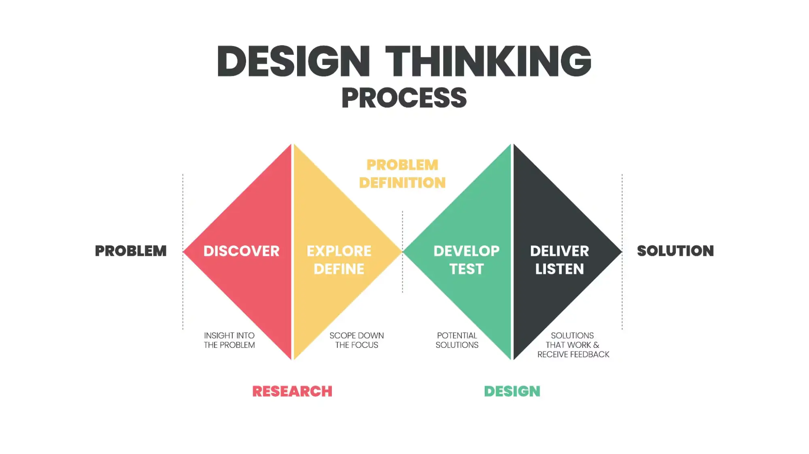

By Prof. Joseph Chan

## General advice for maximizing InboX value

- Reach out for resources proactively: Work space, personnel, industry connection
- Be open-minded about
	- Project topic: Embrace changes from time to time
	- Team members: No competition in the camp. 7/10 entered the science park incumbation programme. Goal is to develop a incumbation-ready level.
- Think about product value - to customers, to investors
- Prototype quickly and **iteratively**
- Empathy: Understand what customers **real** need
  - **Positive** need prompts consumption more than negative need. e.g., swimming
  - Product **hits**

## Two diamond diagram for design

