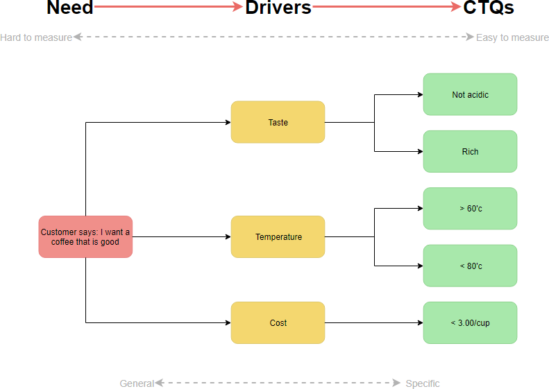
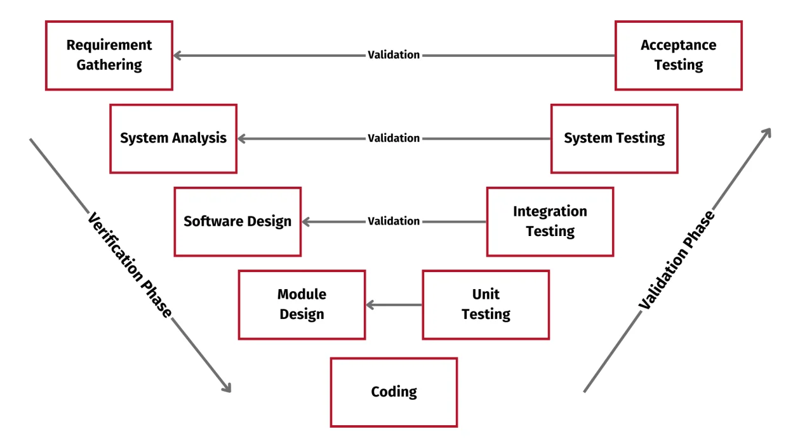

Speaker: Guo Yang

From User Need ("What") to Product Requirement ("How much")<pr>
Product Requirement includes: Functional, Performance, User, Business, Technical & Compliance

### Critical to Quality Tree Methods / Ideal Product Model

### To do
- Trimming the tree, leave the most critical ones (MVP)
- Validate the Voice of the Customer (VOC) from research
- CTQ should be measureable

### V-model

