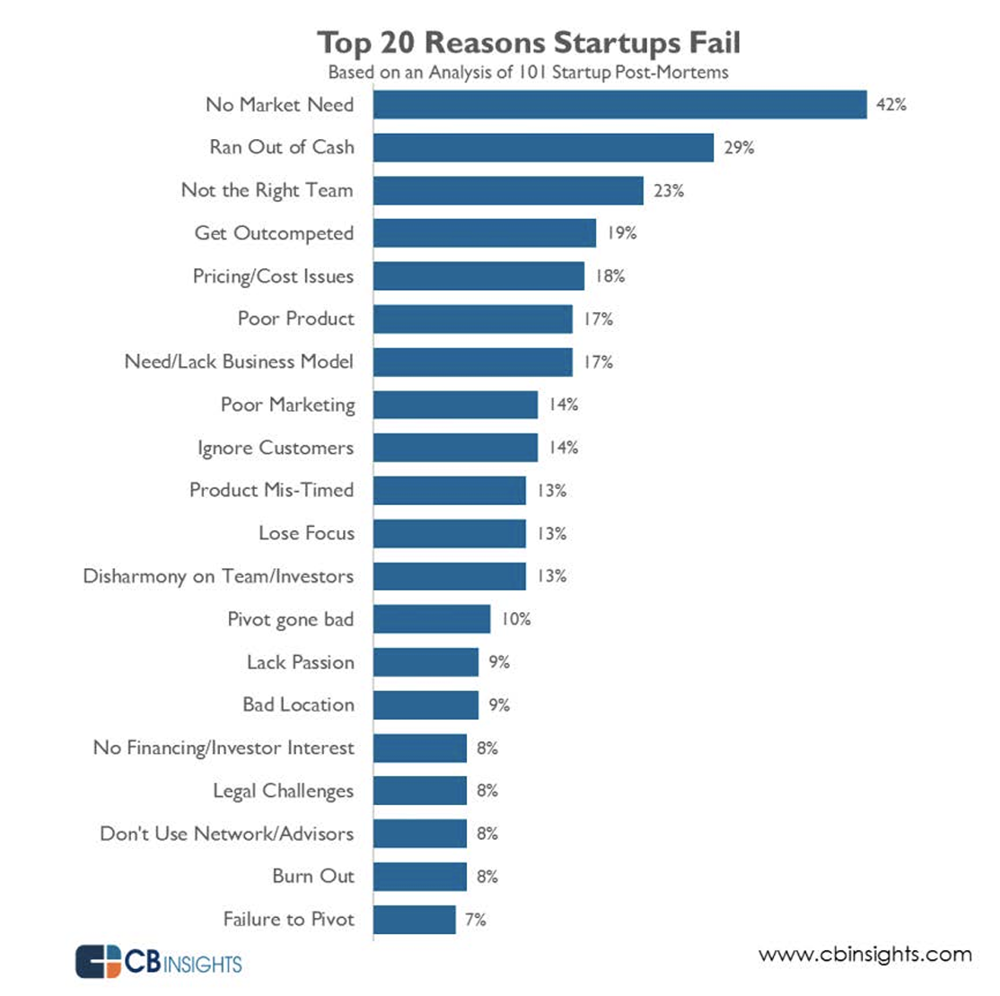
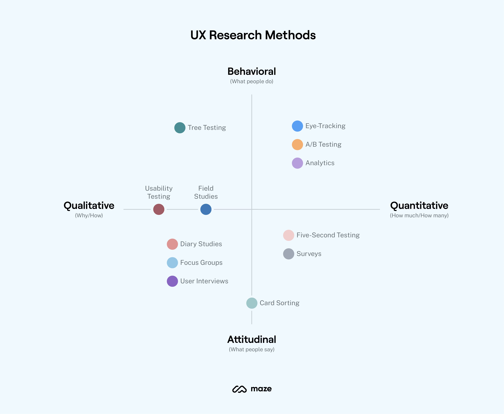

Speaker: Bryan Guo

## User research is important!
The top 1 reason why start-ups fail is no market need.

## Advices
**Talk to real users in the market** to test your assumption about their need. 
How? 
- Qualitative - know why: 1-on-1 interview, focus group, etc.
- Quantitative - test your hypothesis: 

## User research method

Usability Testing: Early feedback on product design (after prototype comes out)
A/B Testing: Select the best concept. Test the conversion rate 转化率
